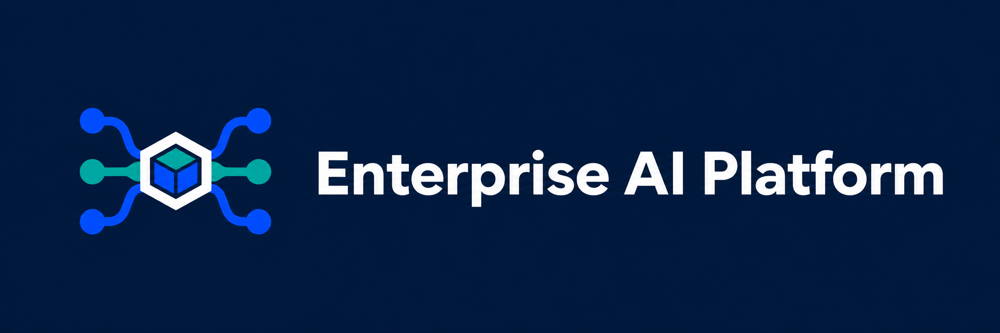

<p align="center">
  
</p>

<p align="center">
  <strong>A self-hosted, identity-aware gateway for organization-wide AI inference.</strong><br>
  Keep clients and model providers replaceable while centralizing access, policy, privacy, and cost controls.
</p>

<p align="center">
  <a href="https://github.com/eponce00/enterprise-ai-platform/actions/workflows/ci.yml"></a>
  <a href="LICENSE"></a>
  
</p>

Enterprise AI Platform gives humans, coding tools, services, and automation one
OpenAI-compatible endpoint. Clients authenticate with short-lived organizational
OIDC tokens; the gateway validates identity, applies policy, attributes usage,
and routes requests to OpenRouter, direct provider APIs, or future local
inference backends.

```text
OpenCode / services ──OIDC JWT──> LiteLLM ──> OpenRouter / direct APIs / local models
                                      │
                                      └── PostgreSQL: teams, budgets, usage, cost
```

Provider credentials stay on the server. The implementation uses official
OpenCode and LiteLLM extension points—no upstream forks, Enterprise license, or
custom administration portal is required.

## Highlights

- OIDC discovery and local JWKS validation with issuer, audience, algorithm,
  time-claim, client, and optional scope checks.
- Configurable human and service-identity mapping to teams, budgets, model
  allowlists, rate limits, and privacy profiles.
- Stable aliases such as `general-fast` and `coding-frontier`, backed by
  replaceable inference providers.
- Policy-filtered OpenRouter discovery with explicit priced routes, stale-cache
  controls, and policy-fingerprint enforcement.
- OpenCode plugin with Authorization Code + PKCE, refresh-token rotation,
  guarded bearer injection, model discovery, and offline alias fallback.
- Prompt and completion logging disabled by default, with server-side OpenRouter
  ZDR and provider-routing controls.
- Free local integration environment using PostgreSQL, development Keycloak,
  and a deterministic mock inference backend.
- Python, TypeScript, and curl examples for non-interactive service identities.

## Quick start

Prerequisites: Docker with Compose, Python 3.10+, and Node.js 22.22.2+.

```sh
cp .env.example .env

docker compose --env-file .env \
  -f gateway/compose.yaml -f gateway/compose.mock.yaml \
  --profile dev-idp --profile mock up --build --wait -d

docker compose --env-file .env \
  -f gateway/compose.yaml -f gateway/compose.mock.yaml \
  --profile mock --profile bootstrap run --rm bootstrap

python -m pip install -e ".[dev,integration]"
npm ci --omit=dev --workspace services/examples/typescript --include-workspace-root=false
pytest -m "integration and not real_provider" tests/e2e
```

The `dev-idp` profile and its seeded Keycloak realm are strictly for local
testing; never expose or reuse them in production. The mock path does not make
paid inference requests. If port `4000` is already in use, set a different
`GATEWAY_HOST_PORT` in `.env` and point `E2E_GATEWAY_URL` at that port. See
[the deployment guide](docs/deployment.md) for credentials, health checks,
cleanup, and production configuration.

## OpenCode

Install official OpenCode 1.18.26, then install the organization-published
plugin package:

```sh
opencode plugin @organization/opencode-ai@0.1.0 --global
```

Organizations should rename the placeholder npm scope and publish it through
their normal private package registry. Before login, deploy the managed plugin
configuration containing the gateway URL, issuer, and client ID; then run:

```sh
opencode auth login --provider organization --method "Company SSO"
```

See [OpenCode setup](docs/opencode-setup.md) for the configuration and rollout
sequence. When refresh-token rotation is required, the production IdP must allow
`offline_access` for the registered OpenCode client and the applicable user
authorization policy.

## Service clients

Applications obtain a short-lived token through OAuth client credentials or
workload identity and call the same gateway endpoint:

```python
client = OpenAI(base_url=GATEWAY_URL, api_key=short_lived_service_token)
response = client.chat.completions.create(
    model="general-fast",
    messages=[{"role": "user", "content": "Hello"}],
)
```

Working Python, TypeScript, and curl clients are under [`services/examples/`](services/examples/).

## Repository map

| Path | Purpose |
| --- | --- |
| [`gateway/`](gateway/) | Pinned LiteLLM image, Compose stack, OIDC auth, policy, and bootstrap |
| [`clients/opencode/`](clients/opencode/) | Installable OpenCode plugin with PKCE and token refresh |
| [`catalog/`](catalog/) | OpenRouter discovery, filtering, aliases, and runtime artifacts |
| [`services/examples/`](services/examples/) | Python, TypeScript, and curl service clients |
| [`tests/e2e/`](tests/e2e/) | Free mock integration path and opt-in real-provider checks |
| [`docs/`](docs/) | Architecture, deployment, identity, security, operations, and ADRs |

## Development

```sh
python -m pip install -e ".[dev]"
python -m ruff format --check .
python -m ruff check .
python -m mypy
python -m pytest -m "not integration and not real_provider"

npm ci
npm run lint
npm run typecheck
npm test
npm run build
npm run test:opencode-smoke
```

CI also validates Compose configurations, package contents, secret patterns,
mock gateway behavior, and an unchanged-client provider-switch sequence. Real
provider tests are explicitly opt-in because they incur cost.

## Production boundary

This repository is a working proof of concept and deployment scaffold, not a
ready-made organizational policy. Before rollout, configure HTTPS, connect the
target IdP, choose approved providers and aliases, set real budgets, integrate a
secrets manager, review retention terms, and run the staging validation described
in [production deployment](infra/production/README.md).

Security and privacy assumptions are documented in [docs/security.md](docs/security.md).
Please report vulnerabilities privately rather than through a public issue.

## License

Licensed under the [Apache License 2.0](LICENSE). Third-party components and
their license boundaries are listed in [THIRD_PARTY_NOTICES.md](THIRD_PARTY_NOTICES.md).
